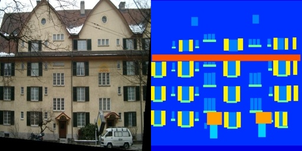
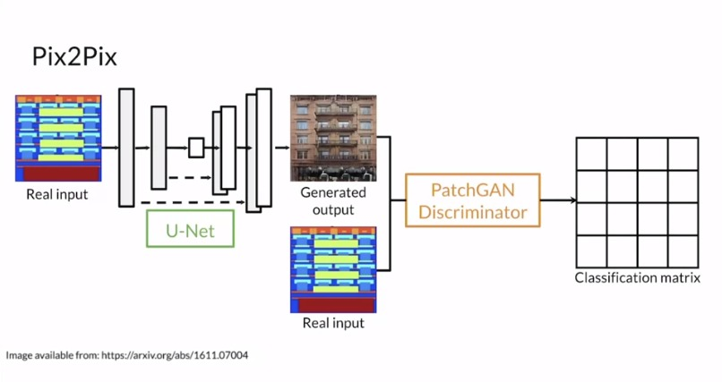
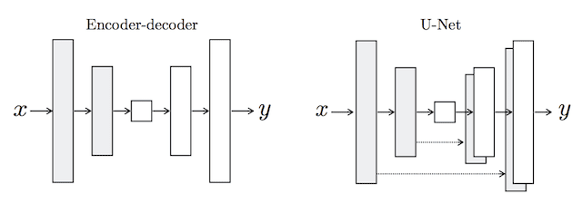
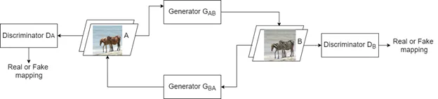
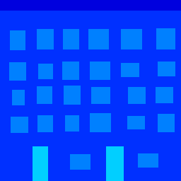
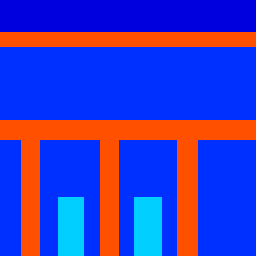
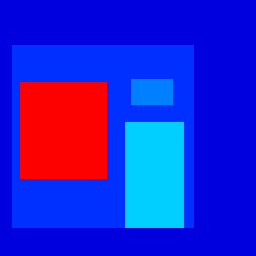

# Pix2Pix and CycleGAN

A lightweight implementation of Pix2Pix and CycleGAN training.

## Implementation

All architectures are implemented for PyTorch framework.

### Dataset

[The dataset](http://efrosgans.eecs.berkeley.edu/pix2pix/datasets/facades.tar.gz) consists of 256x512 images. 
Every image is a side by side concatenation of buildings facades segmentation and buildings facades photos.
See the example below:

The code reads the image (using OpenCV) and crops it in halfs. The implementation is available [under the dataset folder](./dataset/facades_dataset.py).

### Pix2Pix

The Pix2Pix GAN architecture consists of a generator model and a discriminator model.
Both generator and discriminator use modules of the form convolution-BatchNorm-ReLu.

- A U-Net model architecture is used for the generator, instead of the common encoder-decoder model.
The U-Net model architecture is very similar in that it involves downsampling to a bottleneck and upsampling again to an output image, 
but links or skip-connections are made between layers of the same size in the encoder and the decoder, allowing the bottleneck to be circumvented.
- Discriminator is implementing PatchGAN architecture. This is a deep convolutional neural network designed to classify patches of an input image as real or fake, rather than the entire image.

The diagram shows comparison of "classical" encoder-decoder to u-net used in the generator of Pix2Pix.

#### Training

Training script is available at [pix2pix.ipynb](./pix2pix.ipynb)

### CycleGAN

Unlike other GANs, CycleGAN comes really handy when you don't have a pairing image in a dataset.
For example, when converting horses to zebras you usually don't have zebra images in the same surrouding stainding in a similar pose. 

The typical CycleGAN architecture includes two generators and two discriminators that work 
in sync to map images from the source domain to the target domain and vice versa using the same model.

A CycleGAN generator is an autoencoder that takes an input image, 
extracts features from it, and generates another image. 
The generator network consists of three main stages:

- convolutional block
- residual block
- transposed convolutional block

The encoder output passes through the transformer stage which mainly consists of 6 to 9 residual blocks. 

A CycleGAN discriminator is a typical CNN that includes multiple convolutional layers.
This network takes an input image and classifies it as real or fake.
The CycleGAN discriminator is different from that used in the regular GAN.

#### Training

Training script is available at [cyclegan.ipynb](./cyclegan.ipynb)

### Comparison

The detailed comparison available at [comparison.ipynb]() with 
side-by-side images obtained from _Pix2Pix_ and _CycleGAN_.

#### Custom images

I've also prepared a few custom images for test: small house, big building, theatre, and a shop.

The results are given in the next ordering: 

1. custom facades segmentation, 
2. pix2pix generations, 
3. cyclegan generations.

| Small house                                | Big building                                 | Theatre                            | Shop                         |
|--------------------------------------------|----------------------------------------------|------------------------------------|------------------------------|
|  |  |  |  |
|  |  |  |  |

