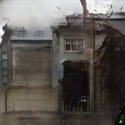

# Pix2Pix and CycleGAN

A lightweight implementation of Pix2Pix and CycleGAN training and inference pipeline.

## Implementation

All architectures are implemented for _PyTorch framework_.

### Dataset

[The dataset](http://efrosgans.eecs.berkeley.edu/pix2pix/datasets/facades.tar.gz) consists of 256x512 images. 
Every image is a side by side concatenation of buildings facades segmentation map and buildings facades photos.

See the example below:

The code reads the image (using OpenCV) and crops it in halfs. 
The implementation is available [under `dataset` folder](./dataset/facades_dataset.py).

### Pix2Pix

The Pix2Pix GAN architecture consists of a generator and a discriminator models.
Both generator and discriminator use modules of the form Convolution->BatchNorm->ReLu.

- A _U-Net model_ architecture is used for the **generator**, instead of the common encoder-decoder architecture.
The U-Net model is quite similar to encoder-decoder as it also involves downsampling to a bottleneck and upsampling again to an output image.
The difference comes from skip-connections - links between layers of the same size in the encoder and the decoder allowing to be circumvent the bottleneck.
- Discriminator is implemented as PatchGAN architecture. This is a deep convolutional neural network designed to classify patches of an input image as real or fake,
rather than the entire image.

The diagram below shows comparison of `encoder-decoder` to `u-net` used in the generator of _Pix2Pix_.

#### Training

Training script is available in [`pix2pix.ipynb`](./pix2pix.ipynb)

#### Results

| Example 1                                | Example 2                                 | Example 3                            |
|--------------------------------------------|----------------------------------------------|------------------------------------|
|  |  |  |
|  |  |  |

### CycleGAN

Unlike other GANs, CycleGAN comes really handy when you don't have a pairing images set.
For example, when converting _horses_ to _zebras_ you usually don't have zebra images in the same surrounding and/or in similar poses. 

The typical CycleGAN architecture includes 2 generators and 2 discriminators that work 
in sync to map images from the source domain to the target domain and vice versa using the same model.
Typical CycleGAN architecture looks similar to the diagram below:

- A **generator** is an autoencoder that takes an input image, extracts features from it, and generates another image. 
The generator network consists of three main stages: convolutional block, residual block, and transposed convolutional block.
The encoder output passes through the transformer stage which mainly consists of 6 to 9 residual blocks. 
- A **discriminator** is a typical CNN that includes multiple convolutional layers. This network takes an input 
image and classifies it as real or fake. The CycleGAN discriminator is different from that used in the regular GAN: 
it maps from the _256x256_ image to an _NxN_ array of outputs X. In that array, each element signifies whether a patch in the image is real or fake. 

#### Training

Training script is available at [`cyclegan.ipynb`](./cyclegan.ipynb)

#### Results

| Example 1                                | Example 2                                 | Example 3                            |
|--------------------------------------------|----------------------------------------------|------------------------------------|
|  |  |  |
|  |  |  |

### Comparison

The detailed comparison available at [`comparison.ipynb`](./comparison.ipynb). The notebook offers 
side-by-side images comparison obtained from _Pix2Pix_ and _CycleGAN_, including a few custom segmentation maps.

#### Custom segmentation maps

The custom segmentation maps set is rather small and was created for fun. 
The set includes 4 images: small house, big building, theatre, and a shop.

The results are given in the next ordering: 

1. custom facades segmentation, 
2. pix2pix generations, 
3. cyclegan generations.

| Small house                                | Big building                                 | Theatre                            | Shop                         |
|--------------------------------------------|----------------------------------------------|------------------------------------|------------------------------|
|  |  |  |  |
|  |  |  |  |
|  |  |  |  |

